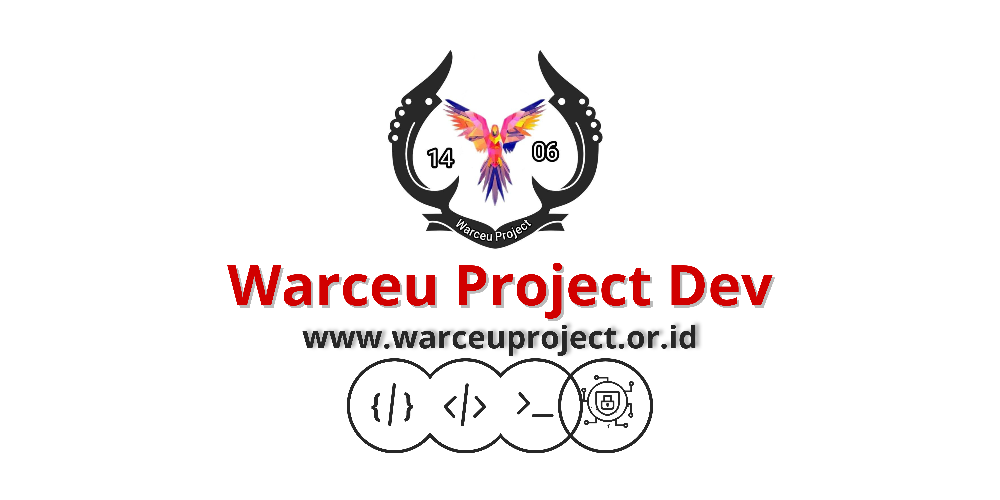

<h1 align="center">WWW.WARCEUPROJECT.OR.ID</h1>

Official GitHub Organization of <strong>Warceu Project</strong>

---

## Tentang Warceu Project

**Warceu Project** adalah komunitas pengembangan teknologi yang berfokus pada:
- Programming
- Cyber Security
- Open Source
- Riset & Eksperimen Teknologi

---

## Repository Resmi

⚠️ **Perhatian**

Repository resmi Warceu Project telah dialihkan ke:

🔗 **https://git.warceuproject.or.id**

GitHub digunakan sebagai **media kolaborasi dan kontribusi komunitas**.

---

## Kontribusi

Kami tidak menerima push langsung ke repository resmi.

### Alur Kontribusi:
1. Fork repository ini
2. Tambahkan project Anda
3. Buat file: di dir contributor/
   ex: contributor/<username>.md (<a href="../contributor/username_temp.md"> Cek template ini )
4. Ajukan Pull Request
5. Project akan direview oleh tim Warceu Project

Project yang lolos review akan ditambahkan ke **repository resmi**  
di **git.warceuproject.or.id**, khusus untuk project yang bersifat serius dan berkelanjutan.

---

## Aturan Umum

- Open source & edukatif
- Tidak mengandung konten ilegal
- Exploit hanya untuk riset dan pembelajaran
- Hormati sesama kontributor

---

## Link Resmi

- Website: https://www.warceuproject.or.id  
- Git Resmi: https://git.warceuproject.or.id  
- GitHub: https://github.com/WarceuProject  

---

<strong>Warceu Project</strong>

